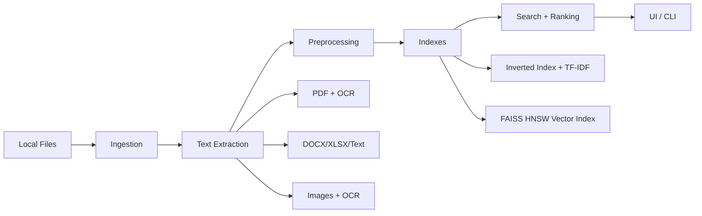
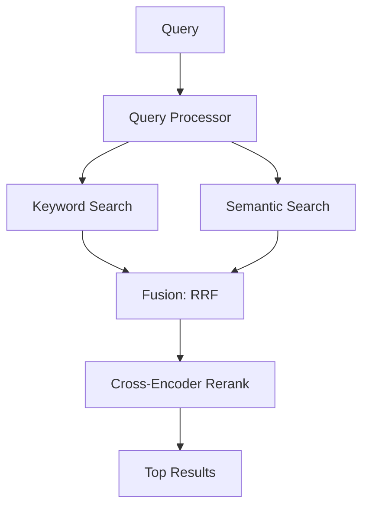
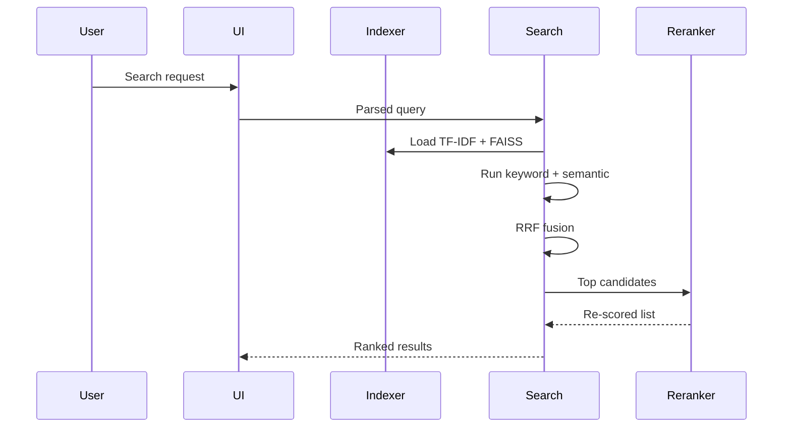

# DocSearch

[](https://www.python.org/)
[](https://learn.microsoft.com/windows/)
[](LICENSE)

DocSearch is an offline multilingual document retrieval system that blends classical IR with neural ranking. It indexes local folders, extracts text from scanned files, and returns results that balance exact keyword matches with semantic understanding across English, Hindi, and Telugu.

This project is built as a practical search engine prototype: privacy-first, CPU-friendly, and designed for real collections that include messy PDFs, noisy OCR, and mixed-language text.

## Why this matters
Local document search is still a hard engineering problem. File systems are not search engines, and enterprise clouds are often a non-option. DocSearch brings search engine techniques to an offline desktop workflow:

- Hybrid retrieval that does not collapse when OCR is noisy or metadata is incomplete.
- Multilingual embeddings for cross-language discovery.
- Reranking focused on top results where user trust is decided.
- Lightweight indexing that stays on-device.

## System architecture







## Technical deep dive
- **TF-IDF keyword retrieval:** precise when text contains the terms; supports phrase and wildcard queries through positional indexing.
- **Embeddings:** multilingual-e5-small encodes text and queries into a shared space with explicit prefixes (`query:` and `passage:`).
- **FAISS HNSW:** approximate nearest neighbor search tuned for fast CPU retrieval while preserving recall.
- **RRF fusion:** rank-based blending of keyword and semantic results; robust to score calibration drift.
- **Cross-encoder reranking:** refines the top candidates with a higher-capacity model for better top-10 precision.
- **Semantic chunking:** splits long documents at semantic boundaries before embedding.
- **OCR pipeline:** PDF rendering via PDFium plus Tesseract OCR for scanned pages and images.

## Evaluation highlights
DocSearch evaluates keyword, semantic, and hybrid pipelines using MRR, MAP, Precision@5, Recall@5, and F1@5. The reranker primarily improves rank quality without sacrificing top-5 precision.

| Mode | MRR | MAP | P@5 | R@5 | F1@5 |
| --- | --- | --- | --- | --- | --- |
| Hybrid (no rerank) | 0.7204 | 0.6398 | 0.2400 | 0.7739 | 0.3472 |
| Hybrid + rerank | 0.7556 | 0.7052 | 0.2400 | 0.7961 | 0.3499 |

Precision vs recall tradeoff is discussed in [docs/evaluation.md](docs/evaluation.md).

## Design decisions
- **RRF instead of linear fusion:** rank-based fusion tolerates mismatched score scales and keeps results stable across query types.
- **HNSW instead of Flat:** lower latency on CPU while retaining strong recall for medium-sized corpora.
- **multilingual-e5-small instead of MiniLM:** better multilingual alignment with smaller memory footprint than larger models.
- **Reranking only on top candidates:** keeps latency practical while increasing top-10 relevance.
- **Offline-first architecture:** all models can load from disk, enabling private deployments.

## Real-world engineering challenges
- **OCR noise:** document quality varies; OCR errors spill into tokenization and ranking.
- **Multilingual retrieval:** cross-script matching requires careful normalization and query handling.
- **Noisy indexing:** scanned PDFs often mix headers, footers, and stamps; chunking helps reduce false positives.
- **Query expansion tradeoffs:** boosts recall on short queries but can hurt precision if overused.
- **Precision vs recall balancing:** hybrid and reranking weights are tuned to favor reliable top results.

## Repository layout

```
configs/        local config assets (synonyms)
data/           generated indexes and user settings (ignored)
docs/           architecture and evaluation writeups
installer/      future installer assets
models/         local model files (ignored)
packaging/      build and release scripts
src/            application code
tests/          test helpers and evaluation fixtures
tools/          one-off analysis and benchmarking scripts
```

## Setup

### 1) Install
```powershell
python -m venv venv
venv\Scripts\Activate.ps1
pip install -r requirements.txt
```

OCR prerequisite: install Tesseract and ensure it is available on PATH.


### 2) Model setup (offline)
Download models to the expected directories (see [docs/system_design.md](docs/system_design.md)):
- [models/sentence-transformers/multilingual-e5-small](models/sentence-transformers/multilingual-e5-small)
- [models/cross-encoder/ms-marco-MiniLM-L-6-v2](models/cross-encoder/ms-marco-MiniLM-L-6-v2)
- [models/cross-encoder/mmarco-mMiniLMv2-L12-H384-v1](models/cross-encoder/mmarco-mMiniLMv2-L12-H384-v1)

Synonym dictionary (optional): [configs/query_synonyms.json](configs/query_synonyms.json)

### 3) Index a folder
```powershell
python -m src.main --index IR_DOCUMNETS
```
Note: the sample corpus folder is named IR_DOCUMNETS (legacy spelling).

### 4) Run search
```powershell
python -m src.main --search "electricity bill" --mode hybrid
```

### 5) Run evaluation
```powershell
python -m src.main --evaluate
```

## UI snapshot


## Documentation
- [docs/architecture.md](docs/architecture.md)
- [docs/system_design.md](docs/system_design.md)
- [docs/evaluation.md](docs/evaluation.md)

## Future work
- stronger multilingual rerankers and domain-specific cross-encoders
- PaddleOCR integration for harder scans
- learning-to-rank and query-dependent fusion
- distributed indexing for larger corpora
- RAG integration for answer synthesis

## License
MIT. See [LICENSE](LICENSE).
