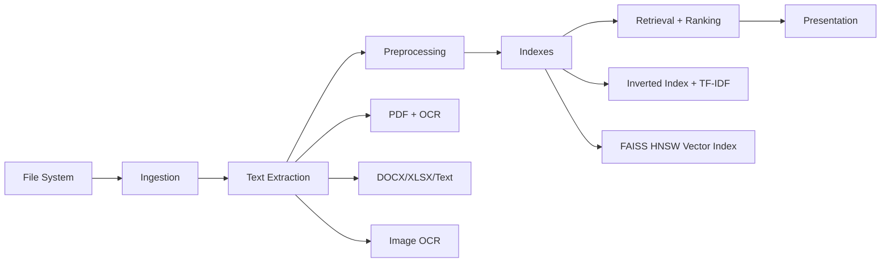
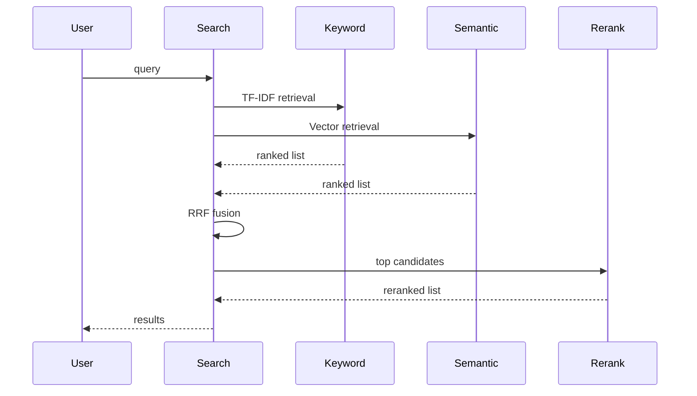

# Architecture

DocSearch is organized as a layered pipeline: ingestion, indexing, retrieval, ranking, and UI. Each layer is designed to operate offline and to tolerate noisy document sources.

## High-level flow

## Components

### Ingestion
- File routing and discovery: [src/ingestion/file_router.py](src/ingestion/file_router.py)
- PDF extraction and OCR fallback: [src/ingestion/pdf_parser.py](src/ingestion/pdf_parser.py)
- Image OCR: [src/ingestion/image_ocr.py](src/ingestion/image_ocr.py)
- DOCX/XLSX/Text parsing: [src/ingestion/docx_parser.py](src/ingestion/docx_parser.py), [src/ingestion/excel_parser.py](src/ingestion/excel_parser.py), [src/ingestion/text_parser.py](src/ingestion/text_parser.py)

### Preprocessing
- Tokenization and normalization (English/Hindi/Telugu): [src/indexer/preprocessor.py](src/indexer/preprocessor.py)
- Filename enrichment and tag injection: [src/ingestion/file_router.py](src/ingestion/file_router.py)

### Indexing
- Positional inverted index: [src/indexer/inverted_index.py](src/indexer/inverted_index.py)
- TF-IDF weighting: [src/indexer/tfidf.py](src/indexer/tfidf.py)
- Dense vector index (FAISS HNSW): [src/indexer/vector_index.py](src/indexer/vector_index.py)

### Retrieval and ranking
- Query parsing and intent detection: [src/search/query_processor.py](src/search/query_processor.py)
- Keyword search: [src/search/keyword_search.py](src/search/keyword_search.py)
- Semantic search: [src/search/semantic_search.py](src/search/semantic_search.py)
- Hybrid fusion (RRF + weighted RRF): [src/search/hybrid_search.py](src/search/hybrid_search.py)
- Cross-encoder reranking: [src/search/cross_encoder_reranker.py](src/search/cross_encoder_reranker.py)

### UI and CLI
- Main entry point (CLI + GUI): [src/main.py](src/main.py)
- Desktop UI: [src/ui/app.py](src/ui/app.py)

## Index storage
All index artifacts are stored locally in [data/](data/) for fast reuse:
- TF-IDF index, inverted index, and metadata
- FAISS index and vector metadata
- Document store for fast snippet rendering

## Query lifecycle

## Offline and privacy-first
- Embedding and reranking models load from local disk when offline mode is enabled.
- No remote APIs or data uploads are required for indexing or search.
- CPU thread limits are applied to keep desktop use responsive.
